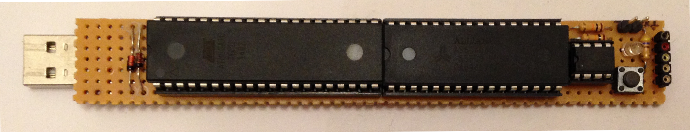
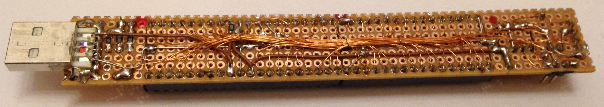

# AVR-USB-Flash-Drive
Proof of Concept - Emulating a usb mass storage device with software implemented USB on an Atmel ATmega 16

The aim of this project was to use an Atmel ATmega 16 microcontroller as a usb mass storage device
(with very, very limited storage size of 32kB) just for the purpose of learning something new and
to test if it would be possible.

The microcontroller does not have hardware USB support. That's why a software library VUSB (former AVR-USB) is
used which implements low-speed USB in software at the microcontroller: https://www.obdev.at/products/vusb/index.html

The microcontroller is connected to an EEPROM chip and additionally to a RAM-chip to buffer the data temporarily before
writing them to EEPROM. The RAM is necessary since the data is sent much faster over USB than it can be written to the
EEPROM. The internal RAM for buffering in the microcontroller is limited, so everything is written to the external RAM first
and later copied to the EEPROM for permanent storage as soon as there is time.

## Pictures

### Thanks to a very good friend for helping with creating the hardware!
